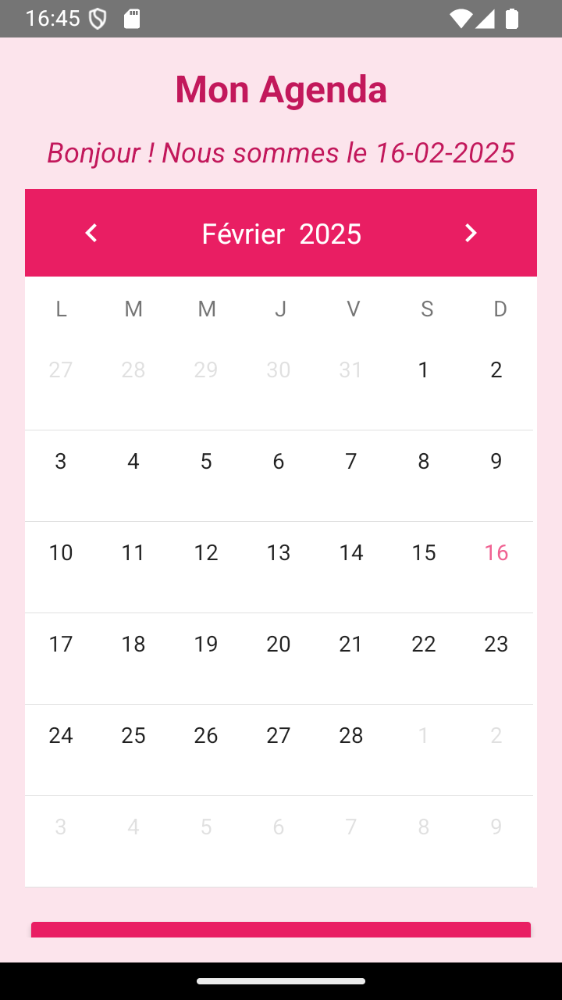
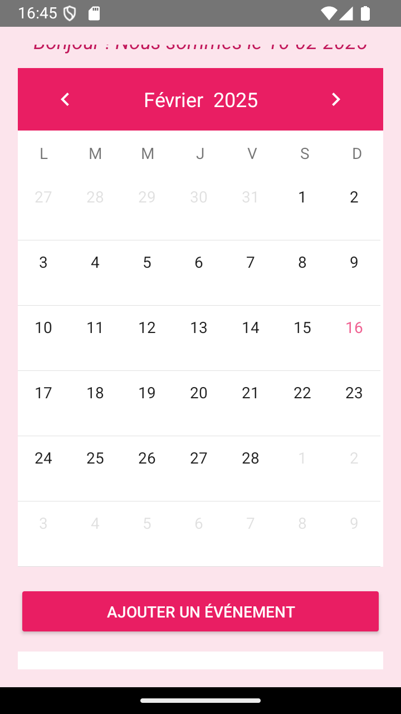
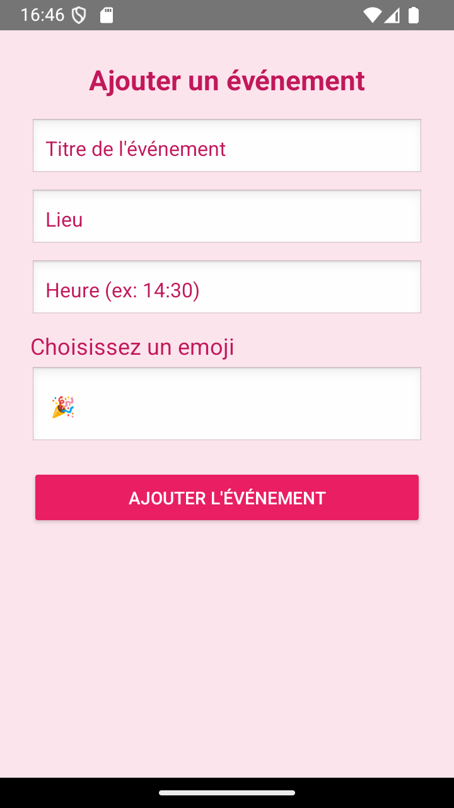
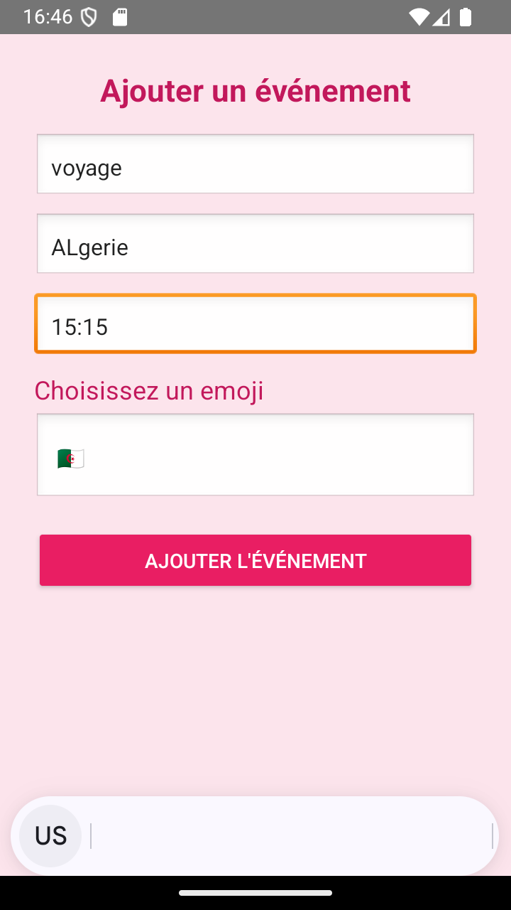
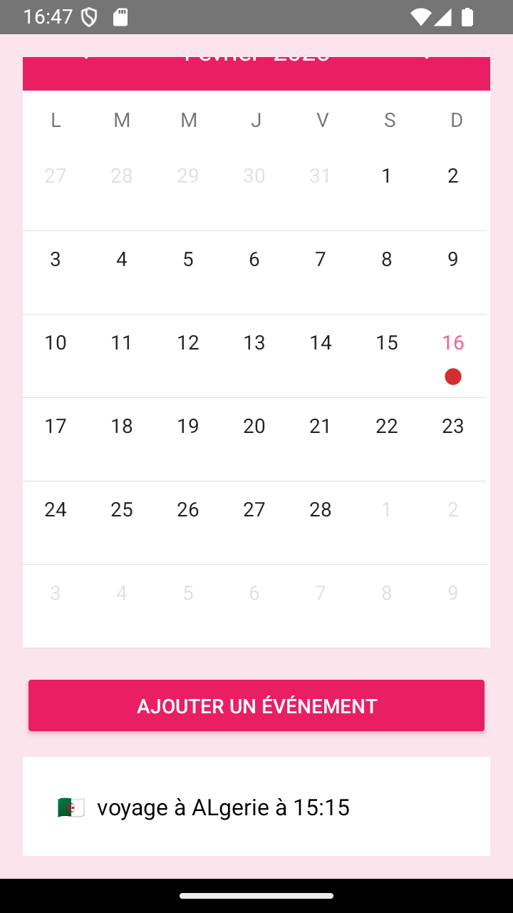
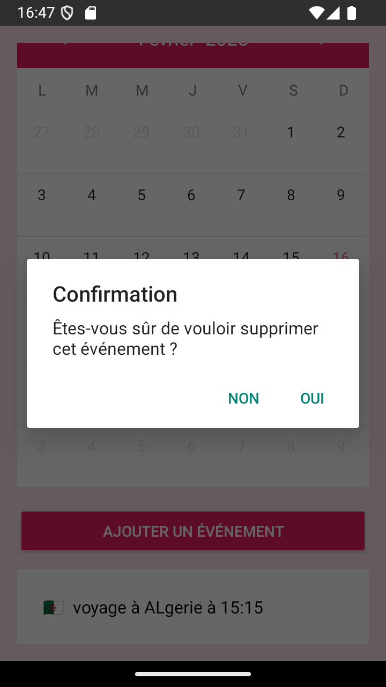

# Calendar_App

## Introduction
L'application **Calendar** permet de gérer un calendrier avec la possibilité d'ajouter des événements selon :  
- 📌 **La catégorie**  
- 📆 **La date**  
- ⏰ **L'heure**  
- 🏷️ **Le nom**  

En cliquant sur un jour spécifique, une liste des événements de ce jour s'affiche.

---
### Setup de l'application

#### Avec android studio:

1. Clonez le dépôt :
   ```bash
   git clone [URL du dépôt]
   ```
2. Ouvrez Android Studio et sélectionnez "Open an existing project".
3. Naviguez jusqu'au répertoire du projet cloné et ouvrez-le.
4. Laissez Android Studio télécharger les dépendances et configurer le projet.
5. Une fois la configuration terminée, cliquez sur "Run" pour exécuter l'application sur un émulateur ou un appareil physique.

#### Sans android studio:

1. Clonez le dépôt : `git clone [URL du dépôt]`
2. Accédez au répertoire du projet : `cd Calendar_App`
3. Installez les dépendances : `./gradlew build`
4. Lancez l'application : `./gradlew run`

### But de l'application
L'application Agenda permet de gérer un calendrier avec la possibilité d'ajouter des événements selon la catégorie, la date, l'heure, et le nom. En cliquant sur un jour spécifique, une liste des événements de ce jour s'affiche.

## Présentation de l'UI
Voici quelques captures d'écran de l'interface utilisateur :

### Écran d'accueil

Ecran d'accueil avec la date du jour, le calendrier avec des puces rouges pour les jours comportant des événements, trois boutons pour les différentes vues et un bouton d'ajout d'événement.

    

### Ajout d'un événement

Ajouter un événement avec un nom, une date, une heure de début et un emoji parmi celles proposées pour representer l'événement.

    

### Liste des événements

Consultation des différents évènements en cliquant sur un jour en particulier. L'évènement affiche le titre, l'heure de début ainsi que l'émoji choisi associée et dan sle calendrier une puce rouge s'affiche pour montrer qu'un événement est présent

  

### Supression d'un événement
Pour supprimer un événement, il suffit de cliquer dessus. Une boîte de confirmation s'ouvrira pour confirmer votre choix.
Une fois qu'on clique sur Oui, l'événement sera supprimer.

  


  
